# Flow Free
<!-- .element: class="fragment  highlight-blue" --> 
By\
Abdulrahman Ragab\
Abdullah Khaled\
Saleh Mahmoud
---n
## Project Structure
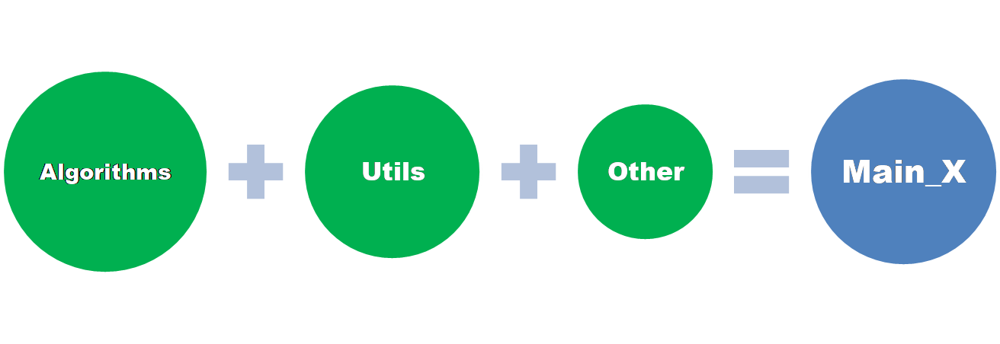
---n
## Coding Style and Considerations 
We decided to separate our codebase into **very small manageable functions (pure functional programming).**
### But Why?
<!-- .element: class="fragment  highlight-blue" --> 
* Easier to test and track single elements
* More beneficial _Profiling_
---n
## Constraints
--v
## Is surrounded square filled
```
Number of neighbors with the same color < 4
```
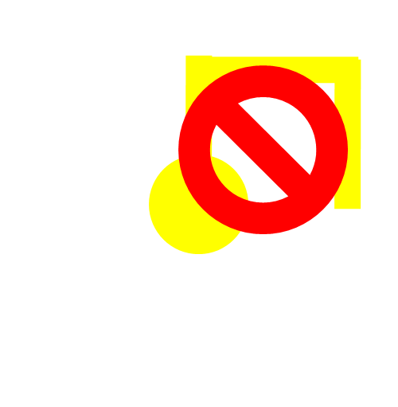
<!-- .element: class="r-stretch"-->
--v
## Is good combination, not the best name 😅
Describes if putting the next assignment will be a good idea!  For its position and the neighboring ones
--v
## “Good” Combinations
```[1|2|3|4-5|6]
Number of free neighbors >= 2 => TRUE
Number of similar neighbors == 1 
and Number of empty neighbors == 1 => TRUE
Number of same color neighbours == 1 and 
No surrounded square filled => TRUE
Otherwise => FALSE
```
--v 

<!-- .slide: data-auto-animate -->
## THE “good“ combinations?
1. Higher than 2 free “not assigned” neighbors for the current assignments and the neighboring assignments too.\
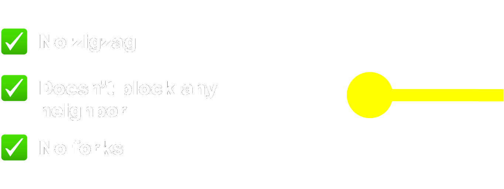

--v

<!-- .slide: data-auto-animate -->
## THE “good“ combinations?
2. Single free and single same color neighbor 
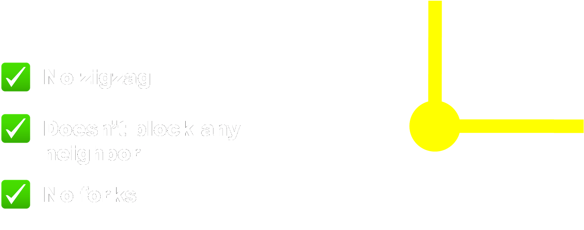

--v

<!-- .slide: data-auto-animate -->
## THE “good“ combinations?
3. If we have similar color nodes surrounding our node we make sure that the surrounding square is not filled
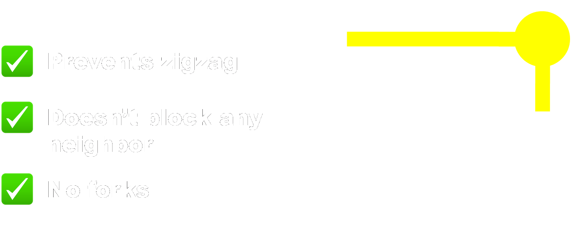

--v

<!-- .slide: data-auto-animate -->
## Otherwise, we have a mess 😞
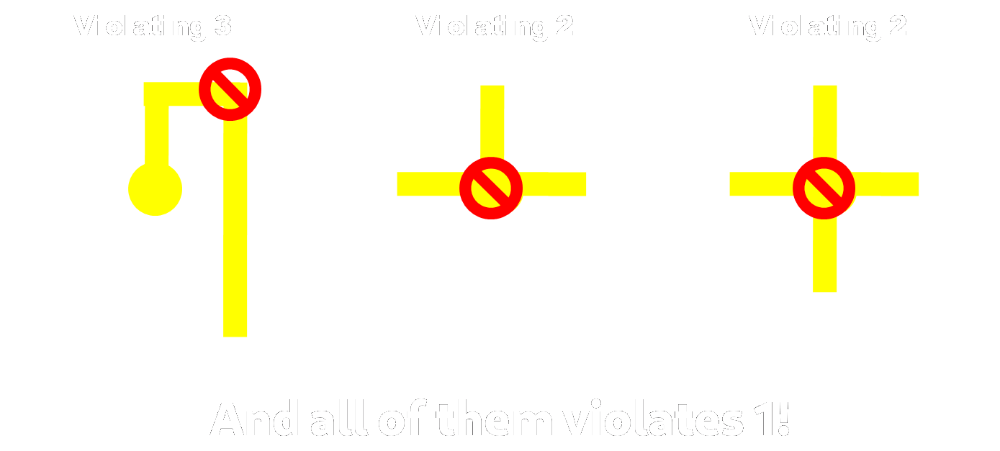
--v
## Free neighboring terminals
The current assignment shouldn't block the neighboring terminals or be the same color if there is a similar color already next to the terminal.
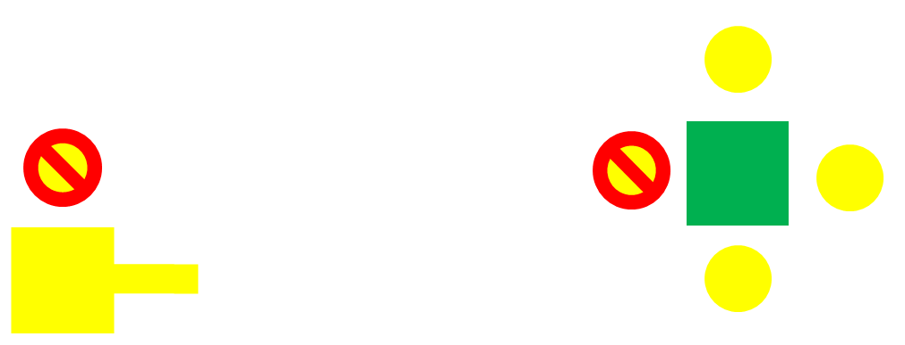
<!-- .element: class="r-stretch"-->

--v
## Same color terminals are not connected
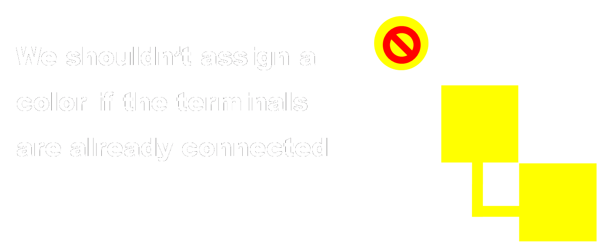
---n
## Backtracking

---n

<!-- .slide: data-auto-animate -->
# Dumb Solver 
<!-- .element: class="fragment highlight-blue" --> 

--v
<!-- .slide: data-auto-animate -->
# Dumb Solver 
<!-- .element: class="fragment highlight-blue" --> 

```[1|2-3|4|5-6]
Choose a random value for a random point and check 
	if it is consistent:
		assign 
	otherwise see the next variable 
	if all variables are not consistent 
		then return failure, and hence backtrack
```

---n

# smart solver
<!-- .element: class="fragment  highlight-blue" --> 

---n

## main components
* Forward checking ​
* MRV (minimum remaining value)​
* Degree heuristic​
* Least constraining value​
---n

<!-- .slide: data-auto-animate -->
## variable domain 
* forward checking
* MRV (minimum remaining value)
--v

<!-- .slide: data-auto-animate -->
## variable domain
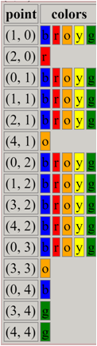

example in 5x5
--v

## variable domain
code implementation 
```js [1|4|7,8|9]
full_domain = colors

point_domain = []
for value in full_domain:

    assignments[coord] = value
    if is_consistant(initial_state, {coord: value},
                    assignments, inp, connected_terminals):
        point_domain += value
    del assignments[coord]

return point_domain
```
--v
<!-- TODO use r-stack -->
<!-- .slide:  data-transition="none" -->
## variable domain    
example 

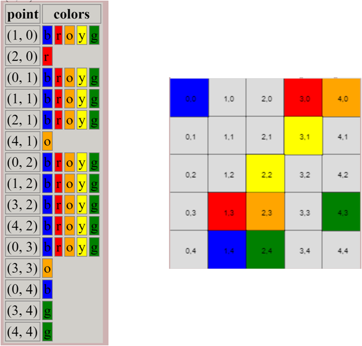
<!-- .element class="r-stretch" -->
--v

<!-- .slide:  data-transition="none" -->
## variable domain    
example 

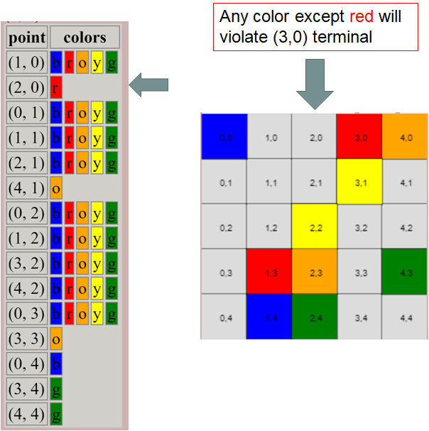
<!-- .element class="r-stretch" -->
--v

<!-- .slide:  data-transition="none" -->
## variable domain    
example 


<!-- .element class="r-stretch" -->
--v

<!-- .slide:  data-transition="none" -->
## variable domain    
example 

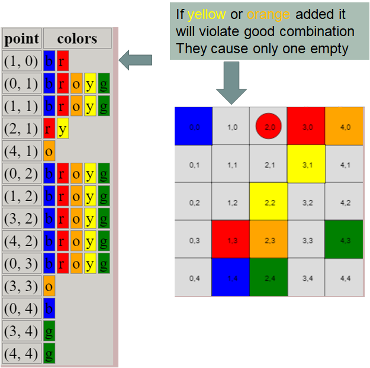
<!-- .element class="r-stretch" -->
---n

# forward checking 
* find domain for variables
* if variable has zero domain 
* return case failure
--v

## forward checking 
```python [|3]
def forward_check(variables_domain):
    for coords in variables_domain:
        if len(variables_domain[coords]) == 0:
            return False
    return True
```
--v

<!-- .slide: data-auto-animate -->
## results
* without forward_check
  | map​ | time​ | Number of hits​ |
  | ---- | ----- | --------------- |
  | 5x5​ | 7 ms​ | 443             |
--v

<!-- .slide: data-auto-animate -->
## results
* without forward_check
  | map​ | time​ | Number of hits​                                        |
  | ---- | ----- | ------------------------------------------------------ |
  | 5x5​ | 7 ms​ | 443 <!-- .element: class="fragment  highlight-red" --> |


* with forward_check
 <!-- .element: style="margin-top:100px" -->
  | map​ | time​ | Number of hits​                                         |
  | ---- | ----- | ------------------------------------------------------- |
  | 5x5​ | 9 ms​ | 28​ <!-- .element: class="fragment  highlight-blue" --> |
---n

<!-- .slide: data-auto-animate -->
# MRV
* find domain for variables
* choose variables with smallest domain
--v

<!-- .slide: data-auto-animate -->
# MRV
* implementation
```python [1-2|3|5|9,10]
    smallest_domain = math.inf
    selected_coords = []
    for coord in variables_domain:
        domain_len = len(variables_domain[coord])
        if domain_len < smallest_domain:
            selected_coords = []
            smallest_domain = domain_len

        if smallest_domain == domain_len:
            selected_coords.append(coord)

    return selected_coords
```
--v

<!-- .slide: data-auto-animate -->
# MRV
applying to 5x5

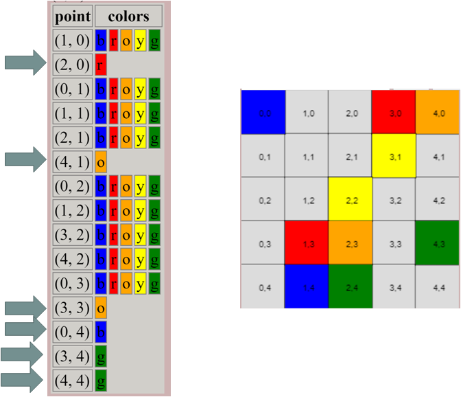
<!-- .element class="r-stretch" -->
--v

<!-- .slide: data-auto-animate -->
# MRV
applying to 5x5

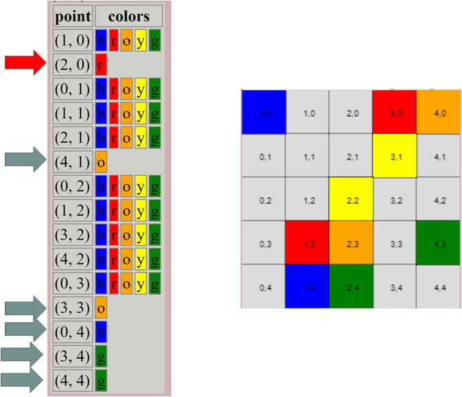
<!-- .element class="r-stretch" -->
--v

#### results *
<!-- https://github.com/A-Siam/FlowFree/pull/2 -->
| map   | time (s) |
| ----- | -------- |
| 7x7   | 1.87     |
| 8x8   | 1.73     |
| 9x9   | 6.87     |
| 10x10 | ?.??     |


--v
<!-- .slide: data-auto-animate -->
### limitation
* variable domain calculation increase with map size

  * example 
<!-- .element: class="fragment" -->
    * 14x14 every time caluclate domain <br/>
      for (<span class="fragment highlight-blue">196 </span> -  terminals) variable
  * solution
<!-- .element: class="fragment" -->
    * update only constrained varialbes

* consistency check represent the bottleneck
--v
<!-- .slide: data-auto-animate -->
### limitation
* variable domain calculation increase with map size
  
* consistency check represent the bottleneck
  
  <span class="fragment"> check <span class="fragment highlight-blue">profile </span>analysis and improve as possible </span>

  
---n
# optimization
<!-- .element: class="r-fit-text" -->
--v

<!-- https://github.com/A-Siam/FlowFree/pull/7 -->
<!-- .slide: data-auto-animate -->
### improvement in constrains
profile for 991


<span> terminal constrain was checking <span class="fragment highlight-red"> every </span>terminal has only on path </span>
--v
<!-- .slide: data-auto-animate -->
### improvement in constrains
profile for 991


<span> check only <span class="fragment highlight-blue"> neighbor </span> terminals </span>
--v

#### results
<!-- https://github.com/A-Siam/FlowFree/pull/2 -->
| map      | time (s) |
| -------- | -------- |
| 7x7      | 0.085    |
| 8x8      | 0.157    |
| 9x9      | 0.858    |
| 10x10(1) | 3.300    |
| 10x10(2) | 1.680    |
| 12x12    | 14.971   |
| 12x14    | ??.???   |
<!-- .element: class="r-stretch" -->
--v

<!-- https://github.com/A-Siam/FlowFree/pull/8 -->
<!-- .slide: data-auto-animate -->
### lazy surrounding squares
<span> check surrounding squares "zigzag" only when have<span style="color: #1B91FF "> 2 same color neighbors. </span>Because if we have a good combination we are in one of these two cases</span>

*  only <span style="color: #1B91FF ">one free neighbor and same color neighbor</span> (no squares)
*  only <span style="color: #1B91FF ">2 or more free neighbors</span> (no squares)
--v
<!-- .slide: data-auto-animate -->
### lazy surrounding squares
#### implementation
```python[7-10]
def check_for_good_combinations(coord, current_color, assignments, inp):
    empty_neighbors = search_around(coord, inp, assignments, is_empty)
    if len(empty_neighbors) >= 2:
        return True
    same_color_neighbors = get_same_color_neighbors(
        coord, current_color, assignments, inp)
    if len(same_color_neighbors) == 2:
        # we don't need is surrounding square anywhere but here
        ssf = is_surrounding_square_filled(assignments,inp,coord)
        return not ssf
    if len(empty_neighbors) == 1 and len(same_color_neighbors) == 1:
        return True
    return False
```
--v
<!-- .slide: data-auto-animate -->
### lazy surrounding squares
#### Results
| map      | time (s) |
| -------- | -------- |
| 10x10(1) | 2.26    |
| 10x10(2) | 1.09    |
| 12x12    | 8.72   |
| 12x14    | ??.???   |
<!-- .element: class="r-stretch" -->

--v
<!-- .slide: data-auto-animate -->
### Cache connected terminals
We can cache connected terminals to quickly check whether or not the selected value is consistent\
Using a shared object between backtracks that gets updated only when a variable is consistent 

--v 
<!-- .slide: data-auto-animate -->
### Cache connected terminals
<!-- .slide: data-auto-animate -->
#### Implementation
Inside backtrack 

```python
if is_consistant(initial_state, {var: value},  assignments, inp, connected_terminals):
    before_assgen_connected_terminal = connected_terminals
    refreshed_connected_terminals = refresh_connected_terminals( {var: value}, assignments, connected_terminals, initial_state, inp)
```
--v
<!-- .slide: data-auto-animate -->
### Cache connected terminals
<!-- .slide: data-auto-animate -->
#### Implementation
Refreshing procedure
```python[1-3|5-12]
def refresh_connected_terminals(current_assignment, assignments, connected_terminals, initial_state, inp) -> set:
    current_assignment_coord = list(current_assignment.keys())[0]
    current_assignment_color = current_assignment[current_assignment_coord]

    terminal_connected = is_terminals_connect(
        initial_state, current_assignment_color, inp, assignments)
    if terminal_connected:
        connected_terminals = connected_terminals.copy()
        connected_terminals.add(current_assignment_color.upper())
        return connected_terminals

    return connected_terminals
```
--v
<!-- .slide: data-auto-animate -->
### Cache connected terminals
#### Results
| map      | time (s) |
| -------- | -------- |
| 10x10(1) | 1.49    |
| 10x10(2) | 0.728    |
| 12x12    | 5.38   |
| 12x14    | ??.???   |
<!-- .element: class="r-stretch" -->

--v 

<!-- .slide: data-auto-animate -->
### dynamic domain-upgrade

* save variable domain
* only update <span class="fragment highlight-blue">constrained variables</span>
--v

<!-- .slide: data-auto-animate -->
### dynamic domain-upgrade

* the constrained variables

  * are variables who share constrain with last updated variable

--v

<!-- .slide: data-auto-animate -->
### dynamic domain-upgrade

* the constrained variables

  *  are empty neighbor  <span class="fragment highlight-blue"> (point good combination) </span>
--v
<!-- .slide: data-auto-animate -->
### dynamic domain-upgrade

* the constrained variables


--v
<!-- .slide: data-auto-animate -->
### dynamic domain-upgrade

* the constrained variables


--v

<!-- .slide: data-auto-animate -->
### dynamic domain-upgrade

* the constrained variables
  
  * are empty neighbor (point good combination) 
  
  * <span class="fragment"> empty neighbor for occupied neighbor 
    <span class="fragment highlight-blue"> (neighbors/terminal good combination) </span> </span> 

--v
<!-- .slide: data-auto-animate -->
### dynamic domain-upgrade

* the constrained variables


--v

<!-- .slide: data-auto-animate -->
### dynamic domain-upgrade

* the constrained variables


--v
<!-- .slide: data-auto-animate -->
### dynamic domain-upgrade

* the constrained variables
  *  are empty neighbor  (point good combination) 
  * are empty neighbor for occupied neighbor   
      (point neighbors/terminal combination)
  * <span class="fragment" > every point when terminal is connected 
      <span class="fragment highlight-blue"> (terminal connected) </span> </span>

--v
### dynamic domain-upgrade
implementation
```python [2,4|5,6|11,12|13|14]
variables_domain = {}
connection_changed = len(connected_terminals)>len(prev_connected_terminal)
first_run = prev_variable == None
if connection_changed or first_run:
    # update all variables
    for coord in variables:
        domain = get_available_domain(coord,
        assignments,connected_terminals)
        variables_domain[coord] = domain
else:
    variables_domain = pickle.loads(pickle.dumps(prev_domain))
    del variables_domain[prev_variable]
    big_neighbors = get_constrained_neighbors(prev_variable,inp,assignments )
    for coord in big_neighbors:
        domain = get_available_domain(coord, assignments, inp,connected_terminals)
        variables_domain[coord] = domain
return variables_domain
```
<!-- .element: class="r-stretch" -->

--v
<style>
    #result_table > tbody > tr >td {
        font-size: 25px;
    }

</style>
#### results
| map​       | time​    | Number of hits​ |
| ---------- | -------- | --------------- |
| 5x5​       | 6 ms​    | 17​             |
| 7x7​       | 16 ms​   | 41​             |
| 8x8​       | 30 ms​   | 52​             |
| 9x9 (1)​   | 57 ms​   | 67​             |
| 10x10 (1)​ | 189 ms​  | 320​            |
| 10x10(2)​  | 93 ms​   | 139​            |
| 12x12​     | 290 ms​  | 331​            |
| 12x14​     | 193 ms​  | 148​            |
| 14x14​     | 7875 ms​ | 10309​          |
<!-- .element: class="r-stretch" id="result_table"-->
---n

## degree heuristic
- use as tie breaker
- choose variable that constrain others
--v

## degree heuristic
implementation
```python [2|5|8]
most_constraining_count = -math.inf
for coord in variables:
    constrained_count = len(
        get_constrained_neighbors(coord,inp, assignments))
    if constrained_count > most_constraining_count:
        most_constraining_count = constrained_count
        most_constraining_var = coord
return most_constraining_var
```
--v
### results
- didn't improve
- made heuristic optional

---n

## least constraining value
- choose value that doesn't affect domains
--v

## least constraining value
implementation
<!-- TODO simplify this -->
```python [2|3,4|8,9|11|12|17]
count_value_ordered = []
for value in domain:
    updated_variable_domains = get_available_domain_multiple(
        {**{coord: value}, **assignments}, inp, coord,)
    count_constrained = 0
    
    for coord in updated_variable_domains:
        if len(updated_variable_domains[coord]) < len(variables_domain[coord]):
            count_constrained += 1

    count_value_ordered.append((count_constrained, value))
count_value_ordered.sort()
order_domain_values = []
for count, value in count_value_ordered:
    order_domain_values += value

return order_domain_values
```
<!-- .element: class="r-stretch" style="font-size: 20px" -->
--v
### for 1414
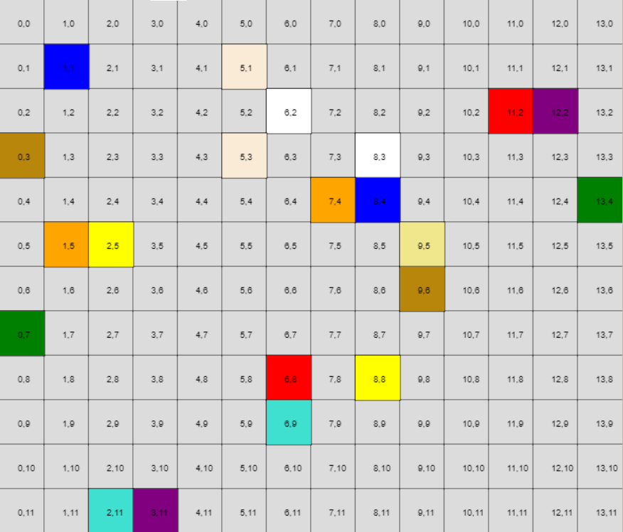
--v
### for 1414

--v
### for 1414

--v
### for 1414

--v
<!-- .slide:  data-transition="none" -->
#### results
| map​       | time​    | Number of hits​ |
| ---------- | -------- | --------------- |
| 5x5​       | 6 ms​    | 17​             |
| 7x7​       | 16 ms​   | 41​             |
| 8x8​       | 30 ms​   | 52​             |
| 9x9 (1)​   | 57 ms​   | 67​             |
| 10x10 (1)​ | 189 ms​  | 320​            |
| 10x10(2)​  | 93 ms​   | 139​            |
| 12x12​     | 290 ms​  | 331​            |
| 12x14​     | 193 ms​  | 148​            |
| 14x14​     | 7875 ms​ | 10309​          |
<!-- .element: class="r-stretch result_table" data-id="table"-->
times maybe different from pc to another
<style>
    .result_table > tbody > tr >td {
        font-size: 25px;
    }

</style>
--v

<!-- .slide:  data-transition="none" -->
#### results
| map​       | time​                              | Number of hits​ |
| ---------- | ---------------------------------- | --------------- |
| 5x5​       | 5 ms​                              | 17​             |
| 7x7​       | 16 ms                              | 56​             |
| 8x8​       | 23 ms​                             | 52​             |
| 9x9 (1)​   | 65 ms​                             | 100             |
| 10x10 (1)​ | 166 ms​                            | 330​            |
| 10x10(2)​  | <span style="color:red"> 240 ms​   | 482             |
| 12x12​     | <span style="color:red"> 838 ms​   | 1178            |
| 12x14​     | <span style="color:aqua"> 163 ms​  | 146​            |
| 14x14​     | <span style="color:aqua"> 2230 ms​ | 2374​           |
<!-- .element: class="r-stretch result_table"  data-id="table"-->
times maybe different from pc to another
<style>
    .result_table > tbody > tr >td {
        font-size: 25px;
    }

</style>
---n

# <span class="fragment highlight-blue"> Smarter solver <span>
using directions
--v
* We used direction values instead of color values.
* Directions offers better arc consistency
<!-- .element: class="fragment" -->
* Values domain is <!-- .element: class="fragment" --><br/>`{'└', '┌', '│', '┘', '─', '┐'}`
<!-- .element: class="fragment" -->
* We can use initially_forced constrains
<!-- .element: class="fragment" -->
--v
* Four corners have initial single domain value propagating until hitting a number.
* Border variables has three values domain.
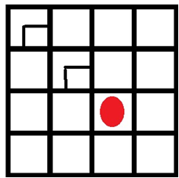
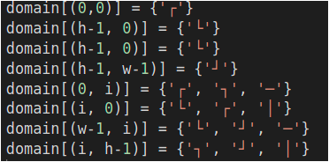
--v
* Directions have powerful arc consistency that can be used initially to eliminate domain values.
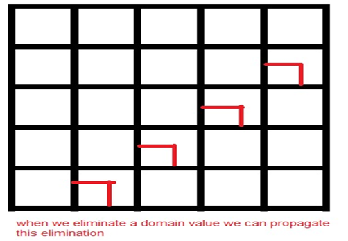
--v
* After forced elimination of domain values we can start assignment.
* We should start by one-domain-value variables
<!-- .element: class="fragment" -->
* After every assignment, the neighbor variables domains is affected 
<!-- .element: class="fragment" -->

--v
* We should add variables for colors to check that the correct colors are connected together.
* There are squares have almost 2 values domain after initial eliminations
<!-- .element: class="fragment" -->

* This is very good branch factor compared to other methods.
<!-- .element: class="fragment" -->
--v
### results

|Map     |time|Number of assignments(hits)|
|--------|--------|---------------------------|
|5X5     |0.6 ms      |15                         |
|7x7     |1 ms      |39                         |
|8x8     |1 ms      |50                         |
|9x9     |7 ms      |75                         |
|10x10(1)|10 ms      |102                         |
|10x10(2)|10 ms      |126                        |
|12x12   |24 ms     |177                        |
|12x14   |24 ms     |186                        |
|14x14   |24 ms     |193                        |

<!-- .element: class="r-stretch result_table"  data-id="table"-->
<style>
    .result_table > tbody > tr >td {
        font-size: 25px;
    }

</style>

---n

# result comparison
--v
## time

| Map      | time (dump) | time(smart) | time(smarter) |
|----------|-------------|-------------|---------------|
| 5X5      | 2 ms​       | 5 ms​       | 0.6 ms        |
| 7x7      | 7 ms​       | 16 ms       | 1 ms          |
| 8x8      | 200 ms​     | 23 ms​      | 1 ms          |
| 9x9      | 80 ms       | 65 ms​      | 7 ms          |
| 10x10(1) | 200 ms​     | 166 ms​     | 10 ms         |
| 10x10(2) | 3 s​        | 240 ms​     | 10 ms         |
| 12x12    | 158 s​      | 838 ms      | 24 ms         |
| 12x14    |  5hr 16min  | 163 ms​     | 24 ms         |
| 14x14    | -           | 2230 ms​    | 24 ms         |
<!-- .element: class="r-stretch result_table"  data-id="table"-->
<style>
    .result_table > tbody > tr >td {
        font-size: 25px;
    }

</style>

--v
## number of hits
| Map      | hits (dump) | hits (smart) | hits (smarter) |
|----------|-----------------------------|------------------------------|--------------------------------|
| 5X5      | 124                         | 17                           | 15                             |
| 7x7      | 452                         | 56                           | 39                             |
| 8x8      | 15695                       | 52                           | 50                             |
| 9x9      | 6208                        | 100                          | 75                             |
| 10x10(1) | 13396                       | 330                          | 102                            |
| 10x10(2) | 255112                      | 482                          | 126                            |
| 12x12    | 12903209                    | 1178                         | 177                            |
| 12x14    | 1548384192                  | 146                          | 186                            |
| 14x14    | -                           | 2374                         | 193                            |
<!-- .element: class="r-stretch result_table"  data-id="table"-->
<style>
    .result_table > tbody > tr >td {
        font-size: 25px;
    }

</style>

---n

# animation
--v
# animation
run flask app
```bash
cd src
python -m flask run
```
> refresh the page 🔃
--v
<iframe src="http://127.0.0.1:5000/" class="r-stretch"></iframe>
